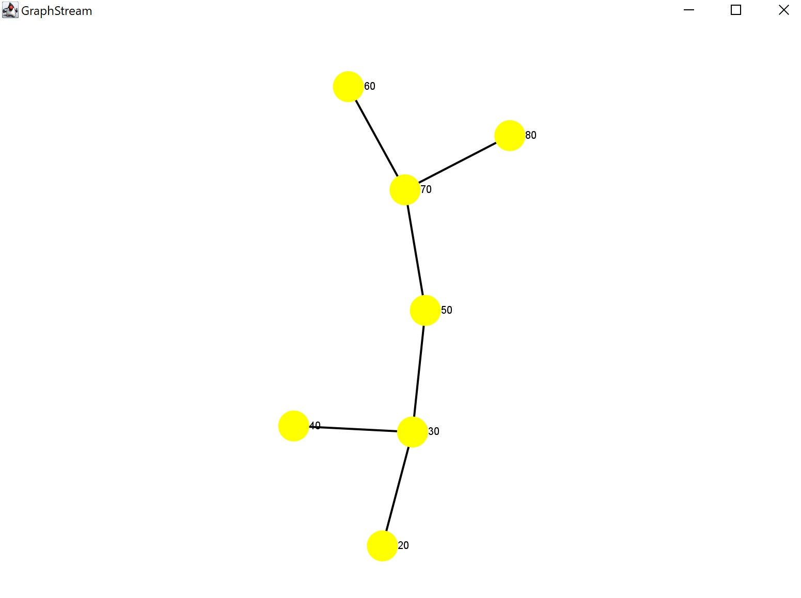

<div align="center">
<table>
    <theader>
        <tr>
            <td></td>
            <th>
                <span style="font-weight:bold;">UNIVERSIDAD NACIONAL DE SAN AGUSTIN</span><br />
                <span style="font-weight:bold;">FACULTAD DE INGENIERÍA DE PRODUCCIÓN Y SERVICIOS</span><br />
                <span style="font-weight:bold;">DEPARTAMENTO ACADÉMICO DE INGENIERÍA DE SISTEMAS E INFORMÁTICA</span><br />
                <span style="font-weight:bold;">ESCUELA PROFESIONAL DE INGENIERÍA DE SISTEMAS</span>
            </th>
            <td></td>
        </tr>
    </theader>
    <tbody>
        <tr><td colspan="3"><span style="font-weight:bold;">Formato</span>: Guía de Práctica de Laboratorio</td></tr>
        <tr><td><span style="font-weight:bold;">Aprobación</span>:  2022/03/01</td><td><span style="font-weight:bold;">Código</span>: GUIA-PRLD-001</td><td><span style="font-weight:bold;">Página</span>: 1</td></tr>
    </tbody>
</table>
</div>

<div align="center">
<span style="font-weight:bold;">GUÍA DE LABORATORIO</span><br />
</div>


<table>
<theader>
<tr><th colspan="6">INFORMACIÓN BÁSICA</th></tr>
</theader>
<tbody>
<tr><td>ASIGNATURA:</td><td colspan="5">Estructura de Datos y Algoritmos</td></tr>
<tr><td>TÍTULO DE LA PRÁCTICA:</td><td colspan="5">TDA BST</td></tr>
<tr>
<td>NÚMERO DE PRÁCTICA:</td><td>04</td><td>AÑO LECTIVO:</td><td>2024 A</td><td>NRO. SEMESTRE:</td><td>III</td>
</tr>
<tr>
<td>FECHA INICIO::</td><td>06-Junio-2024</td><td>FECHA FIN:</td><td>06-Junio-2024</td><td>DURACIÓN:</td><td>02 horas</td>
</tr>
<tr><td colspan="6">RECURSOS:
    <ul>
        <li>https://www.w3schools.com/java/</li>
        <li>https://www.eclipse.org/downloads/packages/release/2022-03/r/eclipse-ide-enterprise-java-and-web-developers</li>
        <li>https://docs.oracle.com/javase/7/docs/api/java/util/List.html</li>
        <li>https://docs.oracle.com/javase/tutorial/java/generics/types.html</li>
    </ul>
</td>
</<tr>
<tr><td colspan="6">DOCENTE:
<ul>
<li>Edson Luque Mamani</li>
</ul>
<tr><td colspan="6">ESTUDIANTE:
<ul>
<li>Hernan Andy Choquehuanca Zapana</li>
</ul>
</td>
</<tr>
</tdbody>
</table>

### OBJETIVOS

- Realizar ejercicios en temas de Estructuras de datos, tipos de datos abstractos, bucles, Arrays, Listas enlazadas, Recursión.

### TEMAS
- TAD
- BST

<details>
<summary>COMPETENCIAS</summary>

- C.m. Construye responsablemente soluciones haciendo uso de estructuras de datos y algoritmos, siguiendo un proceso adecuado para resolver problemas computacionales que se ajustan al uso de los recursos disponibles y a especificaciones concretas.

</details>

## Arbol Binario de Búsqueda (BST) 
El  árbol de búsqueda binaria es un  árbol binario con la siguiente propiedad : Todos los nodos del sub árbol izquierdo de un nodo x son menores o iguales que x y todos los nodos del sub árbol derecho son mayores o iguales que x.

#### Usando la libreria se creó el arbol BST
Aunque requiere de acomodación debido a que maven no llega a ejecutar correctamente el codigo de las ubicaciones de los nodos.



## EJERCICIOS PROPUESTOS

## Parte 01 (clase)

- Elabore un informe implementando Arboles de Búsqueda Binarios con toda la lista de operaciones:
    - search(), getMin(), getMax(), parent(), son(), insert().
    - INPUT: Una sóla palabra en mayúsculas.
    - OUTPUT: Se debe contruir el BST considerando el valor decimal de su código ascii.
    - Luego, pruebe todas sus operaciones implementadas.

- Nodo usando clases genérica:
    -   ```Java
        public class Node<T> {

            // Atributos del objeto Node, el cual contiene la información (data)
            // También las referencias de sus nodos hojos de la izquierda y derecha
            private T data;
            private Node<T> left;
            private Node<T> right;

            //El constructor del objecto Node, definiendo las referencias y la data
            public Node(T data) {
                this.data = data;
                this.left = null;
                this.right = null;
            }

            // Getter y Setter de la data
            public void setData(T data) {
                this.data = data;
            }
            public T getData() {
                return data;
            }

            // Getter y Setter de los nodos hijos            
            public void setLeft(Node<T> left) {
                this.left = left;
            }
            public Node<T> getLeft() {
                return left;
            }
            public void setRight(Node<T> right) {
                this.right = right;
            }
            public Node<T> getRight() {
                return right;
            }
        }

        ```
- BST usando clases genérica:
    -   ``` Java
        // Clase BST la cual implementa la interfaz Comparable
        public class BST<T extends Comparable<T>> {
            private Node<T> root;

            public BST() {
                this.root = null;
            }
                    
            public Node<T> getRoot() {
                return this.root;
            }

            // Método Insert para realizar a búsqueda de un nodo llamado a la función recursiva
            public void insert(T data) {
                this.root = insertRecursive(this.root, data);
            }

            // Método recursivo para insertar una data al árbol BST usando el método compareTo
            private Node<T> insertRecursive(Node<T> root, T data) {
                if (root == null) {
                    return new Node<>(data);
                }

                if (data.compareTo(root.getData()) < 0) {
                    root.setLeft(insertRecursive(root.getLeft(), data));
                } else if (data.compareTo(root.getData()) > 0) {
                    root.setRight(insertRecursive(root.getRight(), data));
                }

                return root;
            }

            // Método Search el cual llama a su función recursiva para realizar la búsqueda
            public boolean search(T data) {
                return searchRecursive(this.root, data);
            }

            // Version recursiva del método search para buscar si es que existe un nodo en el BST
            private boolean searchRecursive(Node<T> root, T data) {
                if (root == null) {
                    return false;
                }

                if (data.compareTo(root.getData()) == 0) {
                    return true;
                } else if (data.compareTo(root.getData()) < 0) {
                    return searchRecursive(root.getLeft(), data);
                } else {
                    return searchRecursive(root.getRight(), data);
                }
            }

            // Métodos get para obtener tanto el mayor como el menor dato del BST
            public T getMin() {
                if (this.root == null) {
                    return null;
                }

                Node<T> current = this.root;
                while (current.getLeft() != null) {
                    current = current.getLeft();
                }

                return current.getData();
            }

            public T getMax() {
                if (this.root == null) {
                    return null;
                }

                Node<T> current = this.root;
                while (current.getRight() != null) {
                    current = current.getRight();
                }

                return current.getData();
            }

            // Método parent para llamar a parentRecursive que implementa la funcion
            public T parent(T data) {
                return parentRecursive(this.root, null, data);
            }

            // Método recursivo para retornar la data del nodo padre en caso tenga
            private T parentRecursive(Node<T> current, Node<T> parent, T data) {
                if (current == null) {
                    return null;
                }

                if (current.getData().equals(data)) {
                    return parent != null ? parent.getData() : null;
                }

                if (data.compareTo(current.getData()) < 0) {
                    return parentRecursive(current.getLeft(), current, data);
                } else {
                    return parentRecursive(current.getRight(), current, data);
                }
            }


            // Método para verificar si el nodo es hijo de otro
            public boolean son(T parentData, T childData) {
                return sonRecursive(this.root, parentData, childData);
            }

            // Son recursivo para implementar la funcion anterior pero de manera recursiva
            private boolean sonRecursive(Node<T> root, T parentData, T childData) {
                if (root == null) {
                    return false;
                }
            
                if (root.getData().equals(parentData)) {
                    return searchRecursive(root, childData);
                }
            
                return sonRecursive(root.getLeft(), parentData, childData) || sonRecursive(root.getRight(), parentData, childData);
            }

        }

        // Método para visualizar la gráfica del BST tree ya craedo
        public void visualizar() {
            Graph graph = new SingleGraph("BST Tree");
            graph.setAttribute("ui.stylesheet", styleSheet);
            graph.setAutoCreate(true);
            graph.setStrict(false);

            visualizarRec(root, graph, 0, 0, 0);

            for (Node node : graph) {
                node.setAttribute("ui.label", node.getId());
            }

            graph.display();
        }

        // Método para generar la vista de manera recursiva, ya que va recorriendo los nodos hijos
        private void visualizarRec(Nodo<T> node, Graph graph, int x, int y, int level) {
            System.out.println("a");
            System.out.println(x);
            System.out.println(y);
            if (node != null) {
                String id = node.getData().toString();
                graph.addNode(id).setAttribute("xy", x, -y);

                if (node.getLeft() != null) {
                    String leftId = node.getLeft().getData().toString();
                    graph.addEdge(id + leftId, id, leftId, true);
                    visualizarRec(node.getLeft(), graph, x - (1 << (4 - level)), y + 1, level + 1);
                    System.out.println("L");
                    
                }

                if (node.getRight() != null) {
                    String rightId = node.getRight().getData().toString();
                    graph.addEdge(id + rightId, id, rightId, true);
                    visualizarRec(node.getRight(), graph, x + (1 << (4 - level)), y + 1, level + 1);
                    System.out.println("R");
                    
                }
            }
        }
        ```

## EJERCICIOS PROPUESTOS
## Parte 02 (casa)
- Estudie la librería Graph Stream para obtener una salida gráfica de su implementación.

> Gráfico realizado con la librería propuesta: 


> Gráfico acomododado:


#

## CUESTIONARIO
¿Explique como es el algoritmo que implementó para obtener el BST con la librería Graph Stream? 

<span style="color: blue">El algoritmo empleado utiliza recursión para visualizar cada nodo de manera recursiva y sus conexiones en un grafo de GraphStream, empleando coordenadas para posicionar los nodos según su nivel en el BST tree.</span>

#

## REFERENCIAS
    - https://www.w3schools.com/java/
    - https://www.eclipse.org/downloads/packages/release/2022-03/r/eclipse-ide-enterprise-java-and-web-developers
    - https://docs.oracle.com/javase/7/docs/api/java/util/List.html
    - https://docs.oracle.com/javase/tutorial/java/generics/types.html
#

[license]: https://img.shields.io/github/license/rescobedoq/pw2?label=rescobedoq
[license-file]: https://github.com/rescobedoq/pw2/blob/main/LICENSE

[downloads]: https://img.shields.io/github/downloads/rescobedoq/pw2/total?label=Downloads
[releases]: https://github.com/rescobedoq/pw2/releases/

[last-commit]: https://img.shields.io/github/last-commit/rescobedoq/pw2?label=Last%20Commit

[Debian]: https://img.shields.io/badge/Debian-D70A53?style=for-the-badge&logo=debian&logoColor=white
[debian-site]: https://www.debian.org/index.es.html

[Git]: https://img.shields.io/badge/git-%23F05033.svg?style=for-the-badge&logo=git&logoColor=white
[git-site]: https://git-scm.com/

[GitHub]: https://img.shields.io/badge/github-%23121011.svg?style=for-the-badge&logo=github&logoColor=white
[github-site]: https://github.com/

[Vim]: https://img.shields.io/badge/VIM-%2311AB00.svg?style=for-the-badge&logo=vim&logoColor=white
[vim-site]: https://www.vim.org/

[Java]: https://img.shields.io/badge/java-%23ED8B00.svg?style=for-the-badge&logo=java&logoColor=white
[java-site]: https://docs.oracle.com/javase/tutorial/


[![Debian][Debian]][debian-site]
[![Git][Git]][git-site]
[![GitHub][GitHub]][github-site]
[![Vim][Vim]][vim-site]
[![Java][Java]][java-site]

[![License][license]][license-file]
[![Downloads][downloads]][releases]
[![Last Commit][last-commit]][releases]

